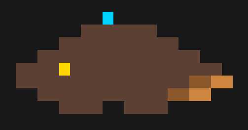
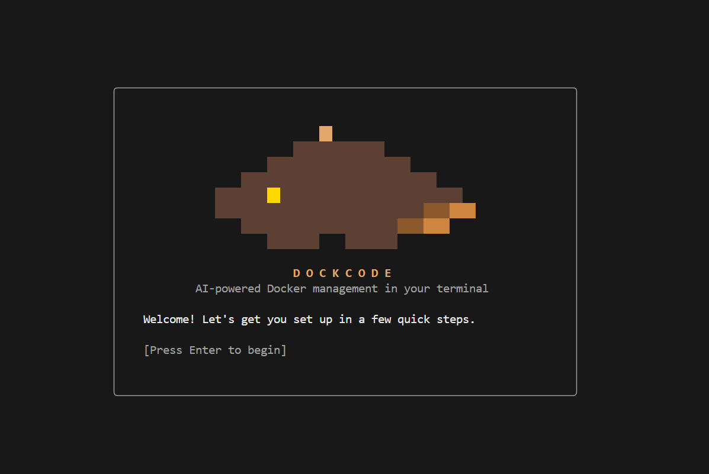
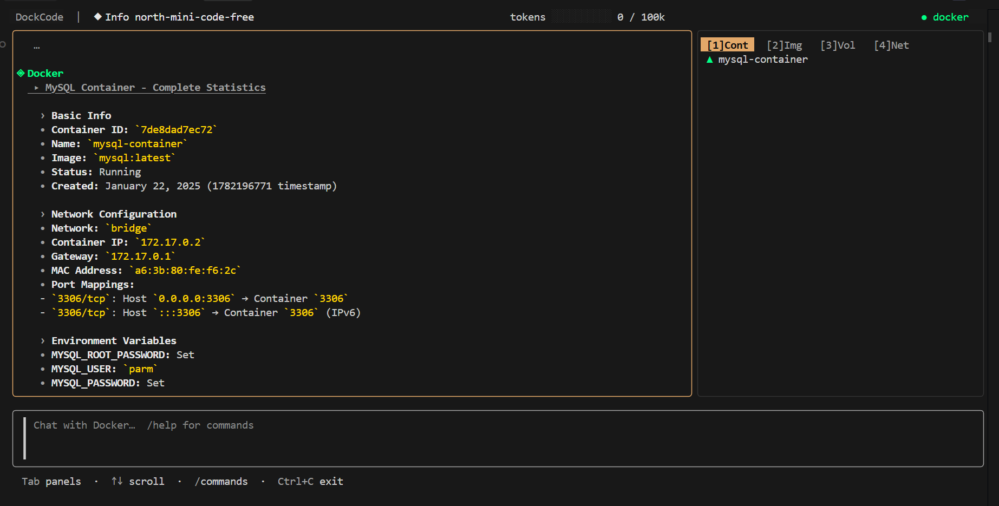

<div align="center">
  
  
  <h1>DockCode</h1>
  <p>
    <b>Chat with Docker in natural language.</b><br>
    An AI-powered, interactive Terminal UI for effortless container management.
  </p>

  <p>
    
    
    
    
  </p>
</div>

<br />

## 📖 Overview

**DockCode** transforms the way you interact with Docker. Stop memorizing complex CLI flags and documentation—simply tell DockCode what you want to achieve in plain English, and watch it orchestrate your containers, images, networks, and volumes in real-time. 

Powered by a robust Go backend and a beautiful Terminal User Interface (TUI), DockCode acts as your personal DevOps assistant. It understands your current Docker state, asks intelligent clarifying questions before executing destructive commands, and supports **any** OpenAI-compatible LLM provider.

---

## 📸 Screenshots

<div align="center">
  <p><b>✨ Seamless Onboarding</b></p>
  
  <p><i>Connect to any OpenAI-compatible provider in seconds. Just paste your Base URL, API Key, and select your preferred model.</i></p>
</div>

<br />

<div align="center">
  <p><b>💬 Intelligent Chat Interface</b></p>
  
  <p><i>Manage your infrastructure using natural language with a live, auto-refreshing sidebar of your Docker state.</i></p>
</div>

---

## 🌟 Features

- 🧠 **Conversational DevOps**: Say *"Spin up a Postgres database with a custom password and map it to port 5432"*, and DockCode handles the complex `docker run` flags automatically.
- 🌐 **Multi-Provider Support**: Works out-of-the-box with **OpenAI, Groq, Ollama, LM Studio, OpenRouter**, and any OpenAI-compatible API.
- 🛡️ **Safe & Smart Execution**: DockCode knows when it lacks context. It will pause and explicitly ask you for missing environment variables, specific image tags, or port mappings before executing.
- 📊 **Live State Sidebar**: An auto-refreshing panel that keeps track of your running Containers, Images, Volumes, and Networks without leaving the chat.
- 🎨 **Beautiful TUI**: Built with [BubbleTea](https://github.com/charmbracelet/bubbletea) and Lipgloss for a gorgeous, responsive, and native terminal experience.
- 💾 **Session Memory**: Context-aware sessions that remember your past actions, container names, and preferences. Save, resume, and export your chat history.
- ⚡ **Production-Grade Engineering**: 
  - Zero goroutine leaks with strict ownership patterns.
  - Bounded worker pools for parallel Docker operations.
  - 3-stage SSE streaming pipeline for buttery-smooth LLM token generation.
  - Graceful shutdown and context cancellation across all concurrent operations.

---

## 🚀 Installation

### Using Go Install (Recommended)
If you have Go 1.22+ installed, you can install DockCode globally with a single command:

```bash
go install github.com/parmeet20/dockcode@latest